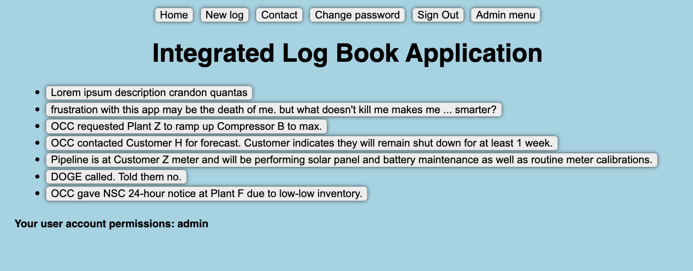

# Integrated Log Book Application

#### App for recording

## Description
This is a shared log book, for tracking events for a team that works shift. Users can create event logs, which are viewable by the entire team. By default, the home page displays all log notes in reverse chronological order, starting with the most recent at the top.

## Table of Contents
* [Technologies Used](#technologiesused)
* [Features](#features)
* [Design](#design)
* [Project Next Steps](#nextsteps)
* [Deployed App](#deployment)
* [About the Author](#author)

## Technologies Used
* JavaScript
* HTML5
* CSS3
* Mongoose
* MongoDB
* Express
* EJS

## Features
* Users can create log notes with a long text description and several other data fields
* Admins can manage user accounts, and control who can access the app

## Wireframe Images
* Wire frames are in [this spreadsheet](https://docs.google.com/spreadsheets/d/1WACeF4qUZYMog_SvjDgD7lg7PLWuINCkp7VSeC22684/edit?gid=230947786#gid=230947786)
<!-- *  -->

## Trello Planning
* [Link to trello planning board](https://trello.com/b/vCOtfM6n/unit-2-project-logbook)

## Design
* Design was inspired by Lotus Notes.

## Project Next Steps
#### List of Future Features
* Implement more data fields
* Implement time stamps for when a note was created and edited
* When a log is saved, send an email to a distribution list based on the event characteristics, such as location
* Link event logs to other files, such as call recordings or SCADA telemetry
* Implement a dark mode and light mode

## Deployed Link
[Heroku]([https://dallas-logbook-app-ba35beb9c99b.herokuapp.com/lognotes/](https://dallas-logbook-app-ba35beb9c99b.herokuapp.com/lognotes/))

* You can view the repository:
[Github.com](https://github.com/dallas-vanwyk/unit-2-project-log-book)

## About The Author
I'm a student in General Assembly, developing skills that will be useful in the workplace - This app has the potential to replace an app my team uses at work, to help streamline our workflows while modernizing our tools.
    
<!-- ## Works Cited:
*https://stackoverflow.com/questions/24093290/what-does-the-question-mark-mean-in-javascript/24093304
*https://www.w3schools.com/jquery/jquery_ref_events.asp
*Understanding “this” in JQUERY: 
* 	the this object doesn't change. It is the owner of the function. It is, in most cases like this, simply a node and you can reference all of its properties like this.className. (think of it as you would a node or whatnot that you get with document.getElementById). It is just the "owner" of the function. Therefore, you are just passing the this object to jQuery's $(). Conclusion: If you want to use jQuery functions for the current node, use $(this). But if you want to access the objects own properties (e.g. .name, className, .id), use simply this.
- https://stackoverflow.com/questions/8469635/jquery-when-to-use-this-and-when-to-use-this

* A constructor: A constructor in Java is a block of code similar to a method that's called when an instance of an object is created. Here are the key differences between aconstructor and a method: A constructor doesn't have a return type. ... Unlike methods, constructorsare not considered members of a class.
- https://www.w3schools.com/java/java_constructors.asp -->
